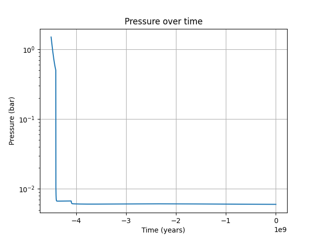
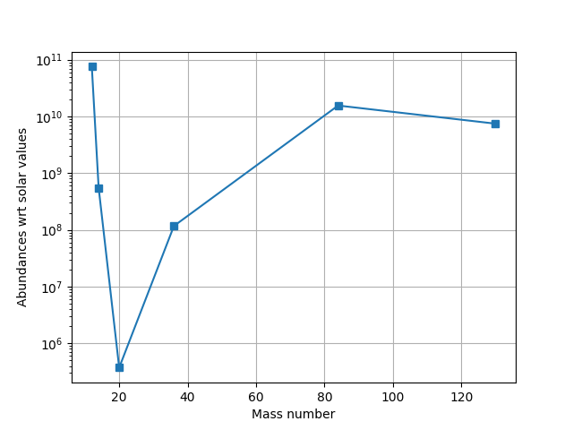
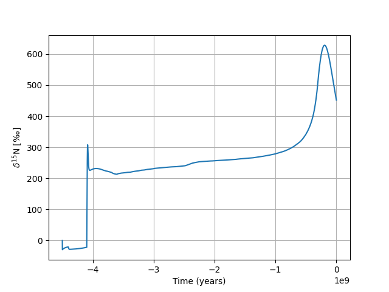

# Mars Atmosphere History
## Running the code
To run the model from the command line just type:

`python3 main.py`

Or if you want to run in interactive mode, type
`ipython3`
to enter ipython3 and from ipython3 you can then run the model by typing:

`run -i main.py `

Note that you only need to type `ipython3` once to enter interactive python, but you may wish to run the model multiple times using `run -i main.py`

## Creating output
After running in ipython you can plot the pressure by typing:

    import matplotlib.pyplot as plt
    plt.ion()
    plt.figure()
    plt.plot(t, ystore[:,1])
    plt.yscale('log')
    plt.ylabel('Pressure (bar)')
    plt.xlabel('Time (years)')
    plt.title('Pressure over time')
    plt.grid()

The shape of the elemental abundances can be shown as follows:

    plt.figure()
    plt.plot(isotopic_data.element_mass, mole_elements/isotopic_data.solar_abundances,'-s')
    plt.yscale('log')
    plt.grid()
    plt.ylabel('Abundances wrt solar values')
    plt.xlabel('Mass number')
    

For the abundance of nitrogen-15 in per mil, this is saved, so can be plotted as follows

    plt.figure()
    plt.plot(t, ystore[:,2])
    plt.ylabel(u'$\delta ^{15}$N [‰]')
    plt.xlabel('Time (years)')
    plt.title('Pressure over time')
    plt.grid()
	

Note that isotope ratios are produced by the model. The isotope ratios considered can be found by typing:

	isotopic_data.isotopes
	
Which will show
> ['d15N',
 '22Ne/20Ne',
 '38Ar/36Ar',
 '78Kr/84Kr',
 '80Kr/84Kr',
 '82Kr/84Kr',
 '83Kr/84Kr',
 '86Kr/84Kr',
 '124Xe/130Xe',
 '126Xe/130Xe',
 '128Xe/130Xe',
 '129Xe/130Xe',
 '131Xe/130Xe',
 '132Xe/130Xe',
 '134Xe/130Xe',
 '136Xe/130Xe']
 
For a simulation that collapses the ratio of $\frac{^{20}Ne}{^{22}Ne}$ is output by calculating the reciprocal of the 2nd entry in the isotope ratio list. There is only one for Ne, the first one:

	1./isotopes_sim[1][0]
which is around 10.5

$\frac{^{38}Ar}{^{36}Ar}$ is the 3rd entry in the isotope ratio list, and there is only one entry for Ar, the first one:

	isotopes_sim[2][0]
which is around 0.23

$\frac{^{86}Kr}{^{84}Kr}$ is the 4th entry in the isotope ratio list, and there are 5 entries for Kr. $\frac{^{86}Kr}{^{84}Kr}$ is the 5th entry:

	isotopes_sim[3][4]
which is around 0.3

$\frac{^{136}Xe}{^{130}Xe}$ is the 5th entry in the isotope ratio list, and there are 8 entries for Xe. $\frac{^{136}Xe}{^{130}Xe}$ is the 8th entry:

	isotopes_sim[4][7]
which is around 1.76

## Overview
This Python model is based on the paper by Kurokawa et al. (2018, [here](http://dx.doi.org/10.1016/j.icarus.2017.08.020)). 

The model starts 4.5 billion years ago with an initial atmospheric pressure (usually 1.5 bar), and solves for the evolution of the atmosphere up until the current day. The initial isotope abundance is assumed to be volcanic. Evolution over time is calculated by dividing the time period into smaller time-steps and incrementing variables over these time-steps. Typically, the time-steps are around 1 million years. 

Over a time-step the number of impacts are calculated using a crater chronology model. This number is scaled so that, over the whole 4.5 billion years, the total impactor mass equals some predefined value (normally 2 $\times$ 1021 kg).

Each impact has a size distribution and velocity distribution individually sampled from separate size and velocity distributions using Monte Carlo sampling. For each impact, during a time interval, we calculate the loss of the atmosphere due to atmospheric eroson. We also assume a volatile fraction of the impactor and add this to the atmosphere. Depending on the impactor type (asteroid or comet) we add elemental trace abundances to the atmosphere. Not only do we add the elemental abundances, but also the isotope composition for the different sources (e.g. the ratios of isotopes of the same element).

Sputtering and photochemical escape for each element in the atmosphere is calculated using a look-up table for CO2, with other elements scaled by this value. The isotope composition is also affected by sputtering (lighter isotopes are more likely to escape). 

Interplanetary dust particles add a continuous flux of elements over time. They also alter the isotope composition (with sources based on observations). 

Volcanic degassing is another continuous source, which changes over time. It adds H2O, CO2, and N2 to the atmosphere. However, it also affects the isotope composition. 

The scale height of the atmosphere affects atmospheric erosion and sputtering. It is calculated throughout the simulation based on the gravitational field of Mars and the atmospheric mass. 

By default the atmosphere is assumed to collapse when the pressure drops below 0.5 bar. Simulations by Forget et al. suggest that this threshold may change depending on the obliquity of Mars. 

## What does the model calculate?
It calculates the evolution of atmospheric pressure, trace element composition, and isotope ratio. In simulations where the atmosphere collapses it reproduces the current day composition and isotope ratio. 
